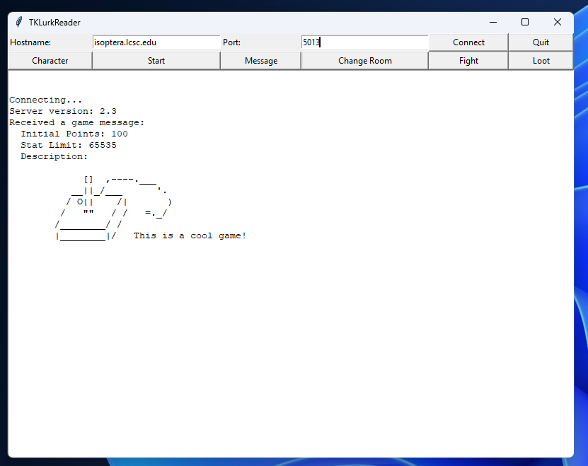
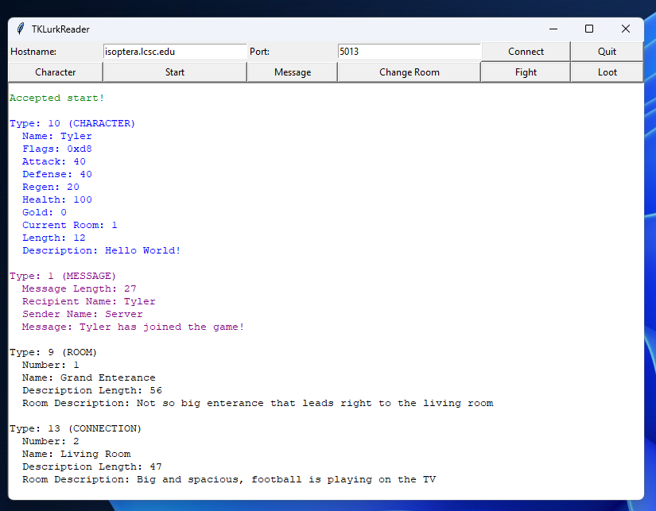
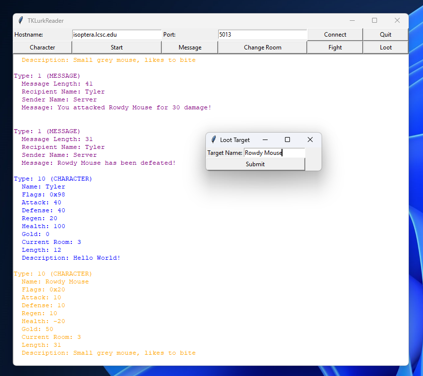
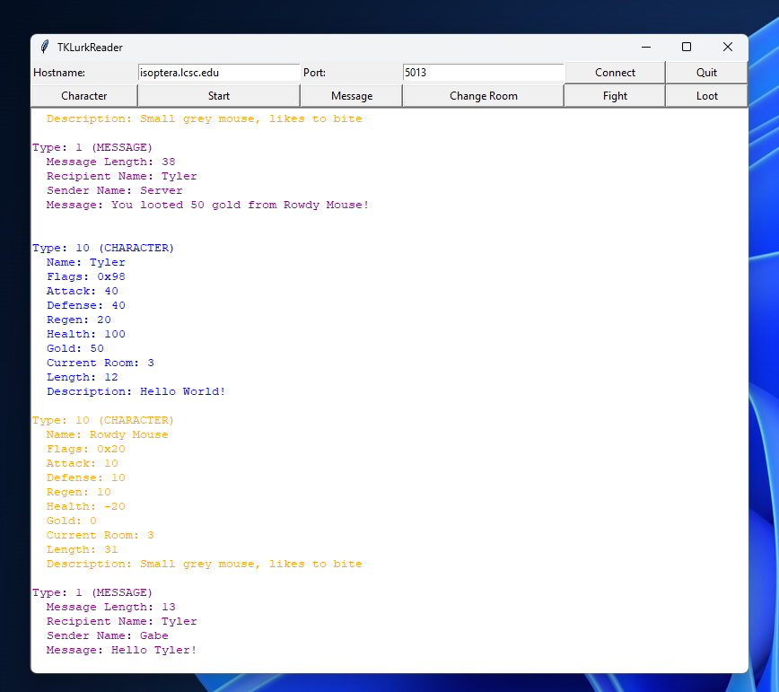

# Multiplayer Game System

This repository houses both the server and client components of a multiplayer game system. The server is built using C/C++ and handles multiple concurrent connections using sockets and POSIX threads. The client, developed in Python with tkinter, provides a graphical interface for real-time interaction with the game server.

Here is the [Protocol](https://isoptera.lcsc.edu/~seth/cs435/lurk_2.3.html) which the project follows. 

Server Features: 

- Manages game state and player interactions in real-time.
- Supports up to 1000 concurrent users.
- Room-based navigation system where players can move between and interact within different rooms.
- Interact with different players or monsters like by messaging or fighting

Client Features: 

- Graphical User Interface using tkinter for easy interaction.
- Real-time messaging between players.
- Interface for changing rooms, managing character attributes, and viewing game status.

Screenshots: 

Prerequisites:

- A Linux-based operating system.
- G++ compiler with support for C++11 or later.
- Python 3.6 or newer.
- tkinter for Python (generally included with Python).

How to Run the Server:
- Clone the repository
- run 'g++ projectServer'
- run './a.out'

How to Run the Client:
- Clone the repository
- run 'python projectClient'
- Have Fun!
